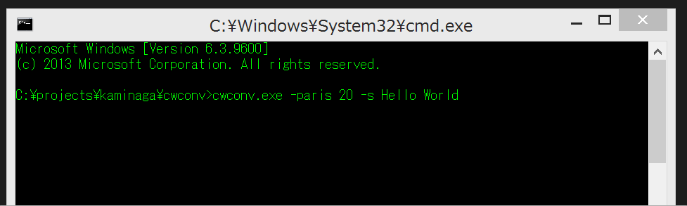

Copyright 2016 Mamoru kaminaga 

cwconv
====
  Play morse sound from command line string. 

## Description
  This tool helps you to practice morse signal decoding. 
  Very small and simple to use. 

## Demo
  Using cwconv from `cmd.exe`. 
  Sound is alos being played with morse simbol text draw. 
  

## Features
  * Use cwconv from vim 
   `vimplugin/cwconv.vim` enables you to use cwconv from vim, text on on clipboard is passed to args (Only avairable from cigwin) 

## Requirement
  * Windows OS 
  * Windows SDK 
  * DirectSound 

## Install
  You can get binary from release page (latest version is `v_1.0.0`). 
  If you build from source code, follow the processes below: 
  1. Setup build environment 
  You have to setup environment for command line build. 

  2. Set path 
  Set environmental variables (`PATH`, `LIB`, `LIBPATH` and `INCLUDE`) for SDKs. 

  3. Fix makefile 
  Customize variable `CC` and `LINK` for your environment. 

  4. Build this program in command line. 
  Be sure `./build` dir exists.

## Usage
  options: 
  `-help` Show help 
  `-nowindow` Not show output console 
  `-nosound` Not play sound 
  `-wpm` Set WPM (default is 20) 
  `-paris` Set PARIS (default is 20) 
  `-s` Set text 

## Example
  * Say "Hello world" with 30 WPM 
  `cwconv.exe -paris 30 -s Hello world` 
  * Show "Hello world" simbol without playing sound 
  `cwconv.exe -nosound -s Hello world` 
  * Play "Hello world" sound without simbol 
  `cwconv.exe -nowindow -s Hello world` 
